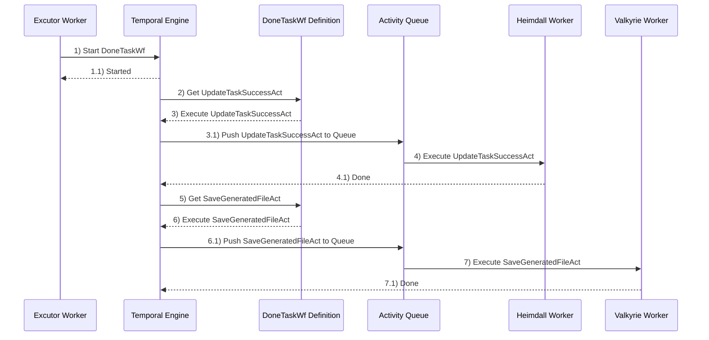

```mermaid
sequenceDiagram
	Excutor Worker ->> Temporal Engine: 1) Start DoneTaskWf
    Temporal Engine -->> Excutor Worker: 1.1) Started
    Temporal Engine ->> DoneTaskWf Definition: 2) Get UpdateTaskSuccessAct
    DoneTaskWf Definition -->> Temporal Engine: 3) Execute UpdateTaskSuccessAct 
    Temporal Engine ->> Activity Queue: 3.1) Push UpdateTaskSuccessAct to Queue 
    Activity Queue ->> Heimdall Worker: 4) Execute UpdateTaskSuccessAct
    Heimdall Worker -->> Temporal Engine: 4.1) Done
    Temporal Engine ->> DoneTaskWf Definition: 5) Get SaveGeneratedFileAct
    DoneTaskWf Definition -->> Temporal Engine: 6) Execute SaveGeneratedFileAct 
    Temporal Engine ->> Activity Queue: 6.1) Push SaveGeneratedFileAct to Queue 
    Activity Queue ->> Valkyrie Worker: 7) Execute SaveGeneratedFileAct
    Valkyrie Worker -->> Temporal Engine: 7.1) Done
```
