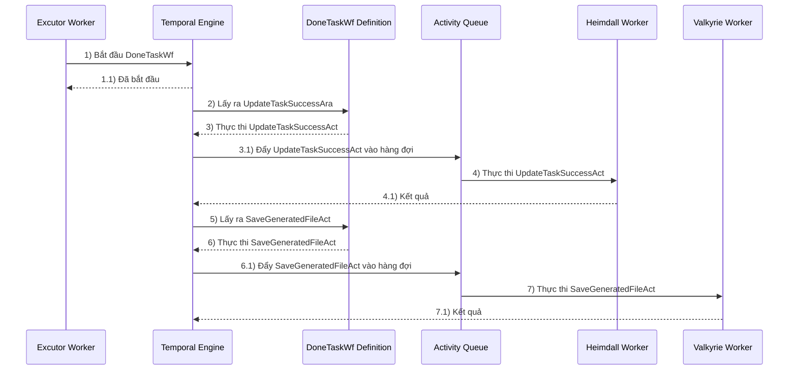

```mermaid
sequenceDiagram
	Excutor Worker ->> Temporal Engine: 1) Bắt đầu DoneTaskWf
    Temporal Engine -->> Excutor Worker: 1.1) Đã bắt đầu
    Temporal Engine ->> DoneTaskWf Definition: 2) Lấy ra UpdateTaskSuccessAra
    DoneTaskWf Definition -->> Temporal Engine: 3) Thực thi UpdateTaskSuccessAct 
    Temporal Engine ->> Activity Queue: 3.1) Đẩy UpdateTaskSuccessAct vào hàng đợi 
    Activity Queue ->> Heimdall Worker: 4) Thực thi UpdateTaskSuccessAct
    Heimdall Worker -->> Temporal Engine: 4.1) Kết quả
    Temporal Engine ->> DoneTaskWf Definition: 5) Lấy ra SaveGeneratedFileAct
    DoneTaskWf Definition -->> Temporal Engine: 6) Thực thi SaveGeneratedFileAct 
    Temporal Engine ->> Activity Queue: 6.1) Đẩy SaveGeneratedFileAct vào hàng đợi
    Activity Queue ->> Valkyrie Worker: 7) Thực thi SaveGeneratedFileAct
    Valkyrie Worker -->> Temporal Engine: 7.1) Kết quả
```
