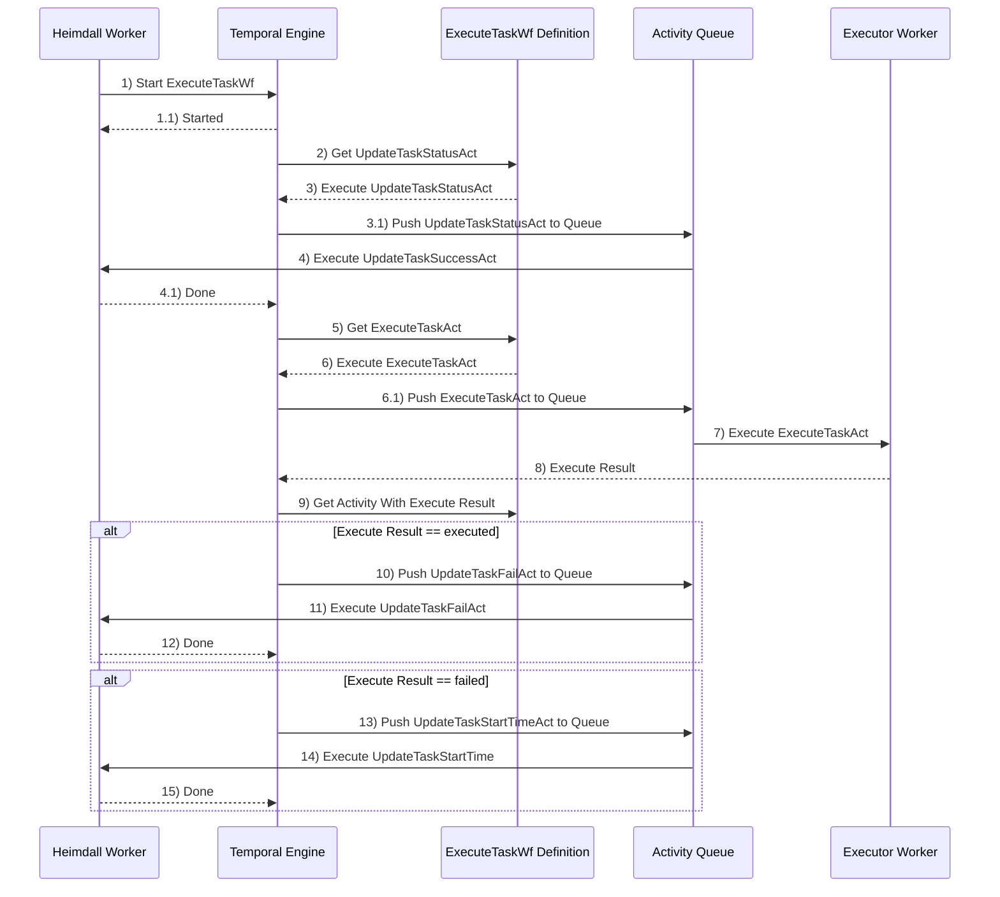

```mermaid
sequenceDiagram
	Heimdall Worker ->> Temporal Engine: 1) Start ExecuteTaskWf
    Temporal Engine -->> Heimdall Worker: 1.1) Started
    Temporal Engine ->> ExecuteTaskWf Definition: 2) Get UpdateTaskStatusAct
    ExecuteTaskWf Definition -->> Temporal Engine: 3) Execute UpdateTaskStatusAct 
    Temporal Engine ->> Activity Queue: 3.1) Push UpdateTaskStatusAct to Queue 
    Activity Queue ->> Heimdall Worker: 4) Execute UpdateTaskSuccessAct
    Heimdall Worker -->> Temporal Engine: 4.1) Done
    Temporal Engine ->> ExecuteTaskWf Definition: 5) Get ExecuteTaskAct
    ExecuteTaskWf Definition -->> Temporal Engine: 6) Execute ExecuteTaskAct 
    Temporal Engine ->> Activity Queue: 6.1) Push ExecuteTaskAct to Queue 
    Activity Queue ->> Executor Worker: 7) Execute ExecuteTaskAct
    Executor Worker -->> Temporal Engine: 8) Execute Result 
    Temporal Engine ->> ExecuteTaskWf Definition: 9) Get Activity With Execute Result 
    alt Execute Result == executed  
        Temporal Engine ->> Activity Queue: 10) Push UpdateTaskFailAct to Queue 
        Activity Queue ->> Heimdall Worker: 11) Execute UpdateTaskFailAct
        Heimdall Worker -->> Temporal Engine: 12) Done
    end 
    alt Execute Result == failed  
        Temporal Engine ->> Activity Queue: 13) Push UpdateTaskStartTimeAct to Queue 
        Activity Queue ->> Heimdall Worker: 14) Execute UpdateTaskStartTime
        Heimdall Worker -->> Temporal Engine: 15) Done
    end 
```
