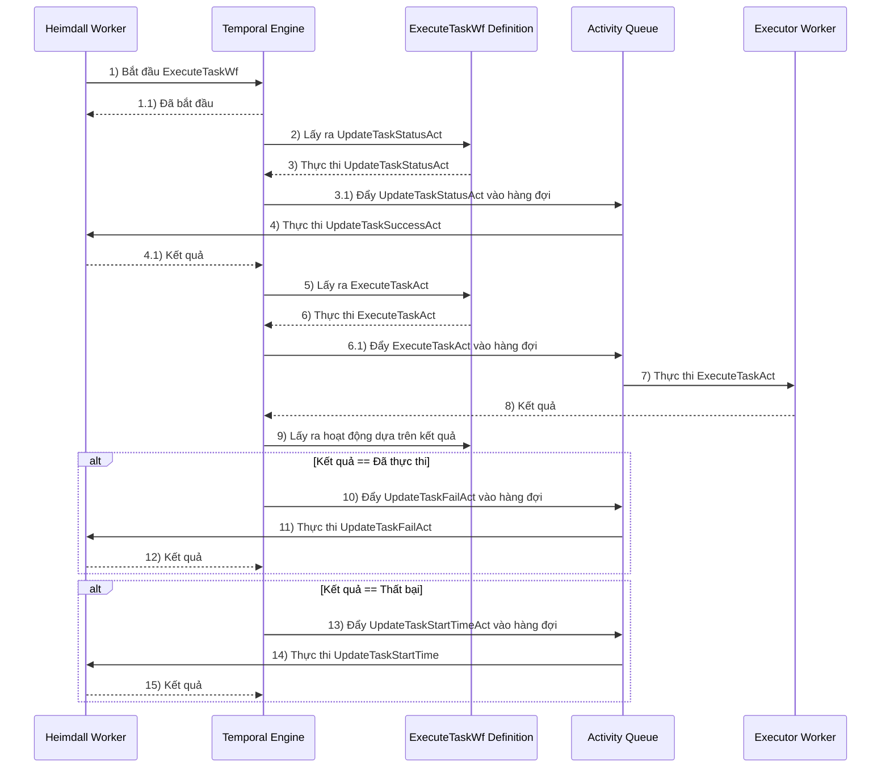

```mermaid
sequenceDiagram
	Heimdall Worker ->> Temporal Engine: 1) Bắt đầu ExecuteTaskWf
    Temporal Engine -->> Heimdall Worker: 1.1) Đã bắt đầu
    Temporal Engine ->> ExecuteTaskWf Definition: 2) Lấy ra UpdateTaskStatusAct
    ExecuteTaskWf Definition -->> Temporal Engine: 3) Thực thi UpdateTaskStatusAct 
    Temporal Engine ->> Activity Queue: 3.1) Đẩy UpdateTaskStatusAct vào hàng đợi
    Activity Queue ->> Heimdall Worker: 4) Thực thi UpdateTaskSuccessAct
    Heimdall Worker -->> Temporal Engine: 4.1) Kết quả
    Temporal Engine ->> ExecuteTaskWf Definition: 5) Lấy ra ExecuteTaskAct
    ExecuteTaskWf Definition -->> Temporal Engine: 6) Thực thi ExecuteTaskAct 
    Temporal Engine ->> Activity Queue: 6.1) Đẩy ExecuteTaskAct vào hàng đợi 
    Activity Queue ->> Executor Worker: 7) Thực thi ExecuteTaskAct
    Executor Worker -->> Temporal Engine: 8) Kết quả 
    Temporal Engine ->> ExecuteTaskWf Definition: 9) Lấy ra hoạt động dựa trên kết quả 
    alt Kết quả == Đã thực thi  
        Temporal Engine ->> Activity Queue: 10) Đẩy UpdateTaskFailAct vào hàng đợi
        Activity Queue ->> Heimdall Worker: 11) Thực thi UpdateTaskFailAct
        Heimdall Worker -->> Temporal Engine: 12) Kết quả
    end 
    alt Kết quả == Thất bại  
        Temporal Engine ->> Activity Queue: 13) Đẩy UpdateTaskStartTimeAct vào hàng đợi 
        Activity Queue ->> Heimdall Worker: 14) Thực thi UpdateTaskStartTime
        Heimdall Worker -->> Temporal Engine: 15) Kết quả 
    end 
```
