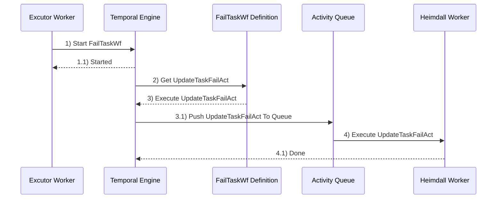

```mermaid
sequenceDiagram
	Excutor Worker ->> Temporal Engine: 1) Start FailTaskWf 
    Temporal Engine -->> Excutor Worker: 1.1) Started
    Temporal Engine ->> FailTaskWf Definition: 2) Get UpdateTaskFailAct 
    FailTaskWf Definition -->> Temporal Engine: 3) Execute UpdateTaskFailAct 
    Temporal Engine ->> Activity Queue: 3.1) Push UpdateTaskFailAct To Queue 
    Activity Queue ->> Heimdall Worker: 4) Execute UpdateTaskFailAct
    Heimdall Worker -->> Temporal Engine: 4.1) Done
```
