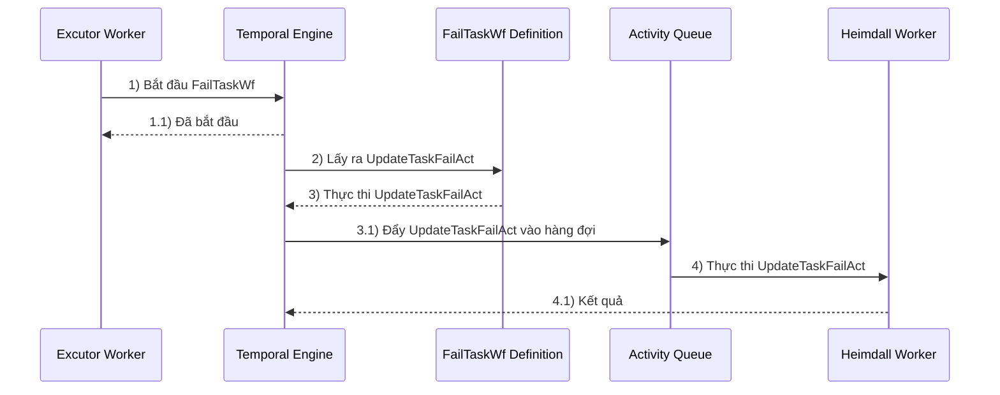

```mermaid
sequenceDiagram
	Excutor Worker ->> Temporal Engine: 1) Bắt đầu FailTaskWf 
    Temporal Engine -->> Excutor Worker: 1.1) Đã bắt đầu
    Temporal Engine ->> FailTaskWf Definition: 2) Lấy ra UpdateTaskFailAct 
    FailTaskWf Definition -->> Temporal Engine: 3) Thực thi UpdateTaskFailAct 
    Temporal Engine ->> Activity Queue: 3.1) Đẩy UpdateTaskFailAct vào hàng đợi 
    Activity Queue ->> Heimdall Worker: 4) Thực thi UpdateTaskFailAct
    Heimdall Worker -->> Temporal Engine: 4.1) Kết quả
```
