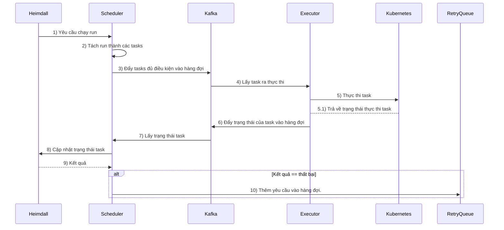

```mermaid
sequenceDiagram
	Heimdall ->> Scheduler: 1) Yêu cầu chạy run  
    Scheduler ->> Scheduler: 2) Tách run thành các tasks
    Scheduler ->> Kafka: 3) Đẩy tasks đủ điều kiện vào hàng đợi
	Kafka ->> Executor: 4) Lấy task ra thực thi
    Executor ->> Kubernetes: 5) Thực thi task
    Kubernetes --> Executor: 5.1) Trả về trạng thái thực thi task
    Executor ->> Kafka: 6) Đẩy trạng thái của task vào hàng đợi
    Kafka ->> Scheduler: 7) Lấy trạng thái task
    Scheduler ->> Heimdall: 8) Cập nhật trạng thái task
    Heimdall -->> Scheduler: 9) Kết quả
    alt Kết quả == thất bại
        Scheduler ->> RetryQueue: 10) Thêm yêu cầu vào hàng đợi.
    end
```
