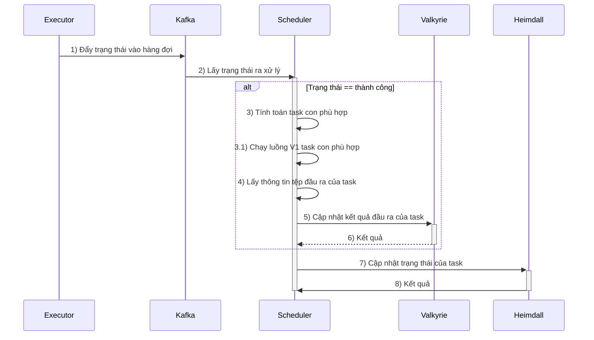

```mermaid
sequenceDiagram
	Executor ->> Kafka: 1) Đẩy trạng thái vào hàng đợi 
    Kafka ->> Scheduler: 2) Lấy trạng thái ra xử lý
    activate Scheduler 
    alt Trạng thái == thành công 
        Scheduler ->> Scheduler: 3) Tính toán task con phù hợp
        Scheduler ->> Scheduler: 3.1) Chạy luồng V1 task con phù hợp
        Scheduler ->> Scheduler: 4) Lấy thông tin tệp đầu ra của task 
        Scheduler ->>+ Valkyrie: 5) Cập nhật kết quả đầu ra của task
        Valkyrie -->>- Scheduler: 6) Kết quả
    end
	Scheduler ->>+ Heimdall: 7) Cập nhật trạng thái của task
    Heimdall ->>- Scheduler: 8) Kết quả
    deactivate Scheduler 
```
