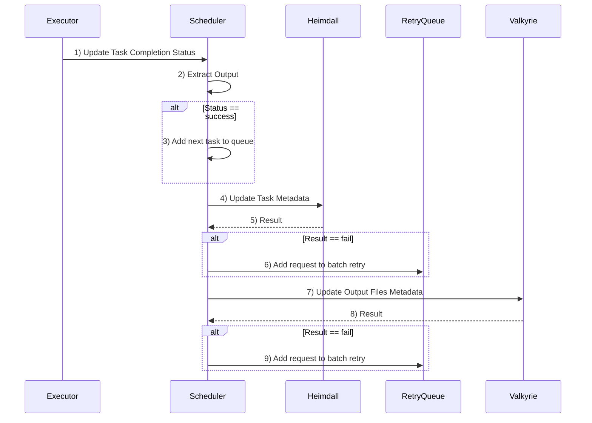

```mermaid
sequenceDiagram
	Executor ->> Scheduler: 1) Update Task Completion Status  
    Scheduler ->> Scheduler: 2) Extract Output
    alt Status == success
        Scheduler ->> Scheduler: 3) Add next task to queue 
    end
	Scheduler ->> Heimdall: 4) Update Task Metadata 
    Heimdall -->> Scheduler: 5) Result
    alt Result == fail 
        Scheduler ->> RetryQueue: 6) Add request to batch retry
    end
    Scheduler ->> Valkyrie: 7) Update Output Files Metadata
    Valkyrie -->> Scheduler: 8) Result
    alt Result == fail 
        Scheduler ->> RetryQueue: 9) Add request to batch retry
    end
```
