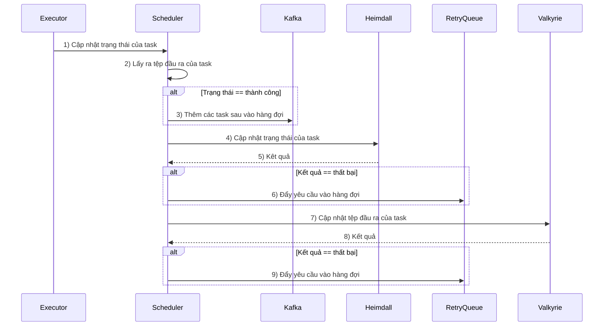

```mermaid
sequenceDiagram
	Executor ->> Scheduler: 1) Cập nhật trạng thái của task  
    Scheduler ->> Scheduler: 2) Lấy ra tệp đầu ra của task
    alt Trạng thái == thành công 
        Scheduler ->> Kafka: 3) Thêm các task sau vào hàng đợi
    end
	Scheduler ->> Heimdall: 4) Cập nhật trạng thái của task
    Heimdall -->> Scheduler: 5) Kêt quả
    alt Kết quả == thất bại 
        Scheduler ->> RetryQueue: 6) Đẩy yêu cầu vào hàng đợi
    end
    Scheduler ->> Valkyrie: 7) Cập nhật tệp đầu ra của task
    Valkyrie -->> Scheduler: 8) Kết quả
    alt Kết quả == thất bại 
        Scheduler ->> RetryQueue: 9) Đẩy yêu cầu vào hàng đợi
    end
```
